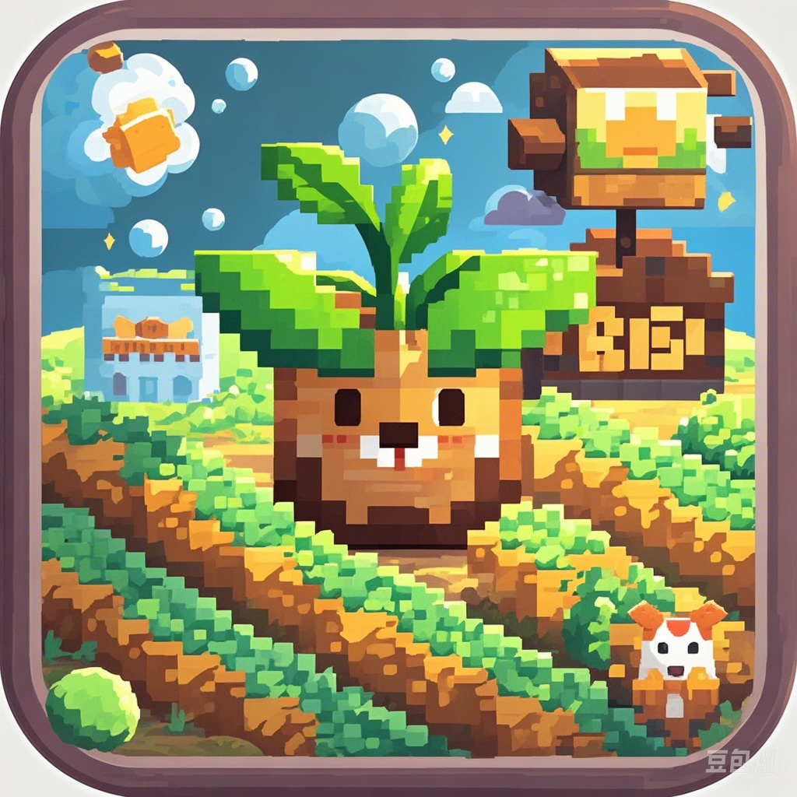

# 🌱 萌芽农场 (Mengya Farm)

<div align="center">
  
  <h3>一款支持多人联机的农场模拟游戏</h3>
  <p>
    
    
    
    
    
  </p>
</div>

## 📖 项目简介

萌芽农场是一款基于Godot 4.4引擎开发的多人在线农场模拟游戏。玩家可以在自己的农场中种植各种作物、饲养宠物、与其他玩家互动，体验丰富的农场生活。游戏采用客户端-服务器架构，支持实时多人联机游戏。

## ✨ 核心功能

### 🌾 农场系统
- **作物种植**: 支持80+种不同作物，包括蔬菜、水果、花卉等
- **地块管理**: 可购买和扩展农场地块
- **作物生长**: 实时作物生长系统，支持施肥、浇水等操作
- **收获系统**: 一键收获、批量种植等便捷操作
- **杂草系统**: 长期离线会长杂草，增加游戏真实感

### 🐾 宠物系统
- **宠物收集**: 多种可爱宠物，每个都有独特属性
- **宠物对战**: 回合制战斗系统，支持技能和装备
- **宠物巡逻**: 宠物可在农场巡逻，增加互动性
- **宠物商店**: 购买和交易宠物

### 🎮 小游戏系统
- **俄罗斯方块**: 经典益智游戏
- **贪吃蛇**: 怀旧小游戏
- **2048**: 数字合成游戏
- **推箱子**: 逻辑解谜游戏

### 🌐 多人联机功能
- **实时同步**: TCP长连接保证数据实时同步
- **访问系统**: 可访问其他玩家的农场
- **点赞系统**: 为其他玩家的农场点赞
- **排行榜**: 多维度玩家排名系统
- **聊天系统**: 全服广播和私聊功能

### 🎁 游戏活动
- **每日签到**: 连续签到获得奖励
- **幸运抽奖**: 随机奖励系统
- **新手礼包**: 新玩家专属奖励
- **在线礼包**: 在线时长奖励

### 🌤️ 环境系统
- **天气系统**: 动态天气变化，影响作物生长
- **昼夜循环**: 真实的时间系统
- **季节变化**: 不同季节的视觉效果

## 🏗️ 技术架构

### 客户端 (Godot 4.4)
```
萌芽农场/
├── MainGame.gd              # 主游戏逻辑
├── GlobalScript/            # 全局脚本
│   ├── GlobalVariables.gd   # 全局变量
│   ├── GlobalFunctions.gd   # 全局函数
│   └── Toast.gd            # 提示系统
├── Network/                 # 网络通信
│   ├── TCPClient.gd        # TCP客户端
│   └── TCPNetworkManager.gd # 网络管理器
├── Scene/                   # 游戏场景
│   ├── BigPanel/           # 大型面板
│   ├── SmallPanel/         # 小型面板
│   ├── SmallGame/          # 小游戏
│   └── NewPet/             # 宠物系统
├── GameManager/            # 游戏管理器
│   ├── DayNightSystem.gd   # 昼夜系统
│   └── WeatherSystem.gd    # 天气系统
└── assets/                 # 游戏资源
    ├── 作物/               # 作物图片
    ├── 宠物图片/           # 宠物资源
    ├── 音乐/               # 背景音乐
    └── GUI/                # UI资源
```

### 服务端 (Python)
```
Server/
├── TCPGameServer.py        # 主游戏服务器
├── TCPServer.py           # TCP服务器基类
├── SMYMongoDBAPI.py       # MongoDB数据库接口
├── QQEmailSendAPI.py      # 邮件验证系统
├── SpecialFarm.py         # 特殊农场管理
├── WSRemoteCmdApi.py      # WebSocket远程控制
├── ConsoleCommandsAPI.py  # 控制台命令
├── requirements.txt       # Python依赖
├── Dockerfile            # Docker配置
└── docker-compose.yml    # Docker编排
```

## 🚀 快速开始

### 环境要求
- **客户端**: Godot 4.4+
- **服务端**: Python 3.13+, MongoDB (可选)
- **系统**: Windows 10+, Android 7.0+

### 客户端运行
1. 安装 [Godot 4.4](https://godotengine.org/download)
2. 克隆项目到本地
```bash
git clone https://github.com/your-username/mengya-farm.git
cd mengya-farm
```
3. 用Godot打开项目文件 `project.godot`
4. 按F5运行游戏

### 服务端部署

#### 方式一：Docker部署 (推荐)
```bash
cd Server
docker-compose up -d
```

#### 方式二：本地部署
```bash
cd Server
pip install -r requirements.txt
python TCPGameServer.py
```

### 配置说明
- 修改 `GlobalScript/GlobalVariables.gd` 中的服务器地址
- 服务器默认端口：7070 (游戏) + 7071 (WebSocket管理)
- MongoDB连接配置在 `SMYMongoDBAPI.py` 中

## 🎯 游戏特色

### 🌟 创新玩法
- **智慧树系统**: 农场装饰，可施肥浇水获得奖励
- **稻草人系统**: 个性化农场装饰，显示自定义消息
- **偷菜系统**: 访问其他玩家农场时可以偷取作物
- **特殊农场**: 服务器管理的特殊活动农场

### 🎨 视觉效果
- **自定义着色器**: 植物摇摆、轮廓高亮等特效
- **粒子系统**: 天气效果、收获特效
- **动画系统**: 流畅的UI动画和作物生长动画
- **响应式UI**: 适配不同分辨率和设备

### 🔧 技术亮点
- **高性能网络**: TCP长连接 + 心跳检测
- **数据持久化**: MongoDB + JSON双重存储
- **模块化设计**: 松耦合的系统架构
- **容器化部署**: Docker一键部署
- **远程管理**: WebSocket远程控制台

## 📊 数据统计

- **作物种类**: 80+ 种
- **宠物类型**: 10+ 种
- **小游戏**: 4 款
- **代码行数**: 15,000+ 行
- **资源文件**: 1000+ 个
- **支持平台**: Windows, Android

## 🛠️ 开发工具

- **游戏引擎**: Godot 4.4
- **编程语言**: GDScript, Python
- **数据库**: MongoDB
- **容器化**: Docker
- **版本控制**: Git
- **图片格式**: WebP (优化)
- **音频格式**: OGG

## 📝 更新日志

### v2.2.0 (当前版本)
- 🆕 新增特殊农场管理系统
- 🆕 WebSocket远程控制台
- 🔧 优化网络连接稳定性
- 🎨 改进UI界面和用户体验
- 🐛 修复多项已知问题

### v2.0.0
- 🆕 全新的宠物对战系统
- 🆕 多人联机功能
- 🆕 天气和昼夜系统
- 🔧 重构代码架构

## 🤝 贡献指南

欢迎提交Issue和Pull Request！

1. Fork 本项目
2. 创建特性分支 (`git checkout -b feature/AmazingFeature`)
3. 提交更改 (`git commit -m 'Add some AmazingFeature'`)
4. 推送到分支 (`git push origin feature/AmazingFeature`)
5. 开启 Pull Request

## 📄 许可证

本项目采用 MIT 许可证 - 查看 [LICENSE](LICENSE) 文件了解详情

## 👥 开发团队

- **主程序员**: [您的名字]
- **美术设计**: [美术师名字]
- **服务端开发**: [后端开发者名字]

## 📞 联系我们

- **项目主页**: [GitHub链接]
- **问题反馈**: [Issues链接]
- **邮箱**: your-email@example.com
- **QQ群**: 123456789

## 🙏 致谢

感谢所有为这个项目做出贡献的开发者和玩家！

---

<div align="center">
  <p>⭐ 如果这个项目对你有帮助，请给我们一个星标！</p>
  <p>Made with ❤️ by 萌芽农场开发团队</p>
</div>